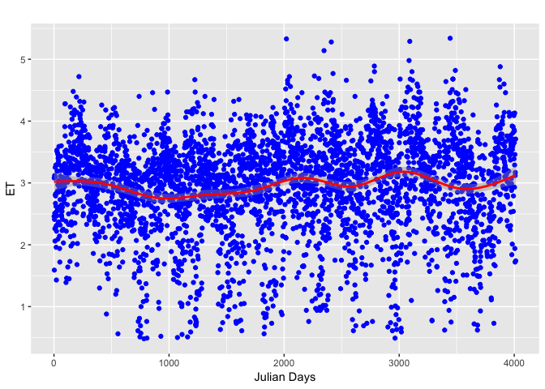
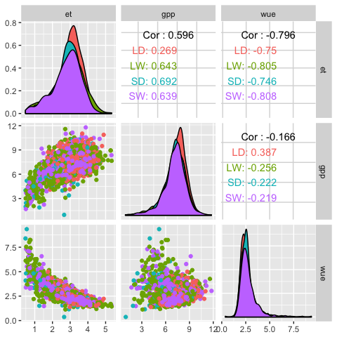

analysis
================
Bruno Hérault
12/13/2017

Question
--------

from Maricar "*We are now finalizing the data analysis for the short article on water fluxes. Water Use Efficiency is the ratio of GPP and ET (evapotranspiration), and one of the analysis is to determine which is driving WUE best, is it the GPP or ET? To do this, I did the gam analysis under the mgcv package (please see the resulting table). It’s the one we used for the analysis in our previous paper for determining the best climate predictor for NEE, RE and GPP. However, Damien would like me to confirm to you whether is it alright to use this kind of analysis since ET and GPP are correlated. He wants to know if we are safe to use the result*"

**GAM is not appropriate to see what is the best driver of WUE given that it is te ratio of 2 other (obviously non-independent) variables**

Data exploration
----------------

*File Name: **daily14.csv** *

### ET trends in time



### GPP trends in time



### WUE trends in time


problem with ratio \#\# Including Plots

You can also embed plots, for example:

``` r
plot(pressure)
```


