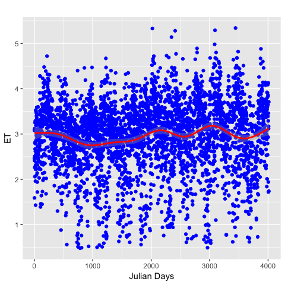
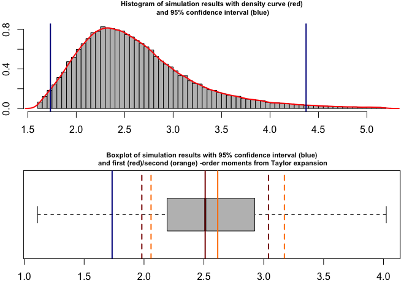

analysis
================
Bruno Hérault
12/13/2017

-   [Question](#question)
-   [Data exploration](#data-exploration)
    -   [Trends in time](#trends-in-time)
    -   [Correlation Plots](#correlation-plots)
-   [Variance partitioning](#variance-partitioning)
    -   [Preliminary assessments](#preliminary-assessments)
    -   [Variance Propagation](#variance-propagation)
    -   [Propagation partitioning](#propagation-partitioning)
-   [Conclusion](#conclusion)

Question
========

from Maricar "*We are now finalizing the data analysis for the short article on water fluxes. Water Use Efficiency is the ratio of GPP and ET (evapotranspiration), and one of the analysis is to determine which is driving WUE best, is it the GPP or ET? To do this, I did the gam analysis under the mgcv package (please see the resulting table). It’s the one we used for the analysis in our previous paper for determining the best climate predictor for NEE, RE and GPP. However, Damien would like me to confirm to you whether is it alright to use this kind of analysis since ET and GPP are correlated. He wants to know if we are safe to use the result*"

**GAM is not appropriate to see what is the best driver of WUE given that it is te ratio of 2 other (obviously non-independent) variables**

Data exploration
================

*File Name: **daily14.csv** *

``` r
data<-read.csv2(file="daily14.csv", sep=",", header = T, dec=".")
data$day<-(data$year-2004)*365+data$doy
```

Trends in time
--------------



Correlation Plots
-----------------


Partial correlation per season (LD, LR, LW, SW)

Variance partitioning
=====================

Preliminary assessments
-----------------------

The question of WUE variance is quite easy if GPP and ET do not share any covariance. We check it.

``` r
data<-na.omit(data)
str(cov(data$gpp,data$et))
```

    ##  num 0.576

Covariance is high so that we cannot decipher the contribution of GPP and ET analytically. this is not tracatable, at least easily. So that we have to use propagation of uncertainty using higher-order Taylor expansion and Monte Carlo simulation. More on this [here](http://www.sciencedirect.com/science/article/pii/S0263224107000681).

Variance Propagation
--------------------

``` r
library(propagate)
EXPR11<-expression(GPP/ET)
GPP <- data$gpp
ET <- data$et
DAT11 <- makeDat(EXPR11)
RES11 <- propagate(expr = EXPR11, data = DAT11, type = "raw", 
                  do.sim = TRUE, verbose = TRUE) 
RES11
```

    ## Results from error propagation:
    ##    Mean.1    Mean.2      sd.1      sd.2      2.5%     97.5% 
    ## 2.5107806 2.6155655 0.5290829 0.5569026 1.5171001 3.7157010 
    ## 
    ## Results from Monte Carlo simulation:
    ##      Mean        sd    Median       MAD      2.5%     97.5% 
    ## 2.6516448 2.0190171 2.5104820 0.5261077 1.7315251 4.3770877

``` r
plot(RES11)
```



Propagation partitioning
------------------------

``` r
contribution(RES11)
```


    ##       GPP        ET 
    ## 0.3964361 0.6035639

Conclusion
==========

**39.6% of the variance of WUE comes from GPP**

**60.4% of the variance of WUE comes from ET**
